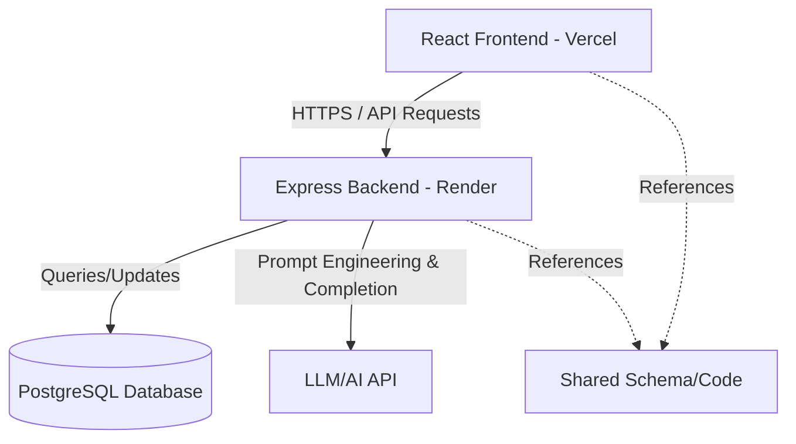

# System Architecture - AI-Powered SQL Query Generator

This monorepo contains the codebase for the AI-Powered SQL Query Generator application, divided into separate frontend and backend workspaces, along with a shared package.

## Workspace Structure

The project follows a modular monorepo structure:
- **`frontend/`**: A React 19 single-page application powered by Vite, utilizing Tailwind CSS v4 for UI styles, Axios for API calls, and React Router for view navigation. Designed to deploy seamlessly on Vercel.
- **`backend/`**: A Node.js and Express.js REST API with ES Modules, configured to use PostgreSQL and Prisma ORM for persistent storage, and Zod for API request validation. Designed to deploy on Render.
- **`shared/`**: Contains common resources, constants, schemas, or models shared between both layers.

## Frontend Structure

The React application is structured to support scalability and standard page/layout nesting:
- **`src/layouts/`**: Wrappers for different parts of the application (e.g., standard layout with header/footer, auth shell, dashboard).
- **`src/contexts/`**: React contexts providing global states (e.g., app-wide configuration, UI theme, etc.).
- **`src/components/`**: Modular, reusable presentation components (buttons, cards, forms).
- **`src/pages/`**: Feature pages corresponding to routes.
- **`src/routes/`**: Client-side routing definition using React Router.
- **`src/services/`**: API integration client configurations using Axios.
- **`src/utils/`**: Helper methods, string formatters, and client-side validation logic.

## Backend Structure

The backend server is structured for Express with ES Modules:
- **`src/server.js`**: Application entry point that handles server instantiation, port bindings, and connection handshakes.
- **`src/app.js`**: Core Express configurations, mounting global middlewares (CORS, JSON Parser, etc.) and registering routes under `/api/v1`.
- **`src/routes/`**: Router mount points mapping endpoints to controllers.
- **`src/controllers/`**: Receives request inputs, performs Zod validations, delegates to services, and constructs HTTP responses.
- **`src/services/`**: Business-layer services encapsulating AI prompting logic, DB interactions, and database connections.
- **`src/utils/`**: Shared utilities, formatters, and logger configurations.

## Environmental Configuration

Both services are decoupled and rely entirely on environment variables. In development, templates are provided via:
- `/frontend/.env.example`
- `/backend/.env.example`

In production, variables should be injected directly through the hosting provider's dashboard (Vercel and Render).
