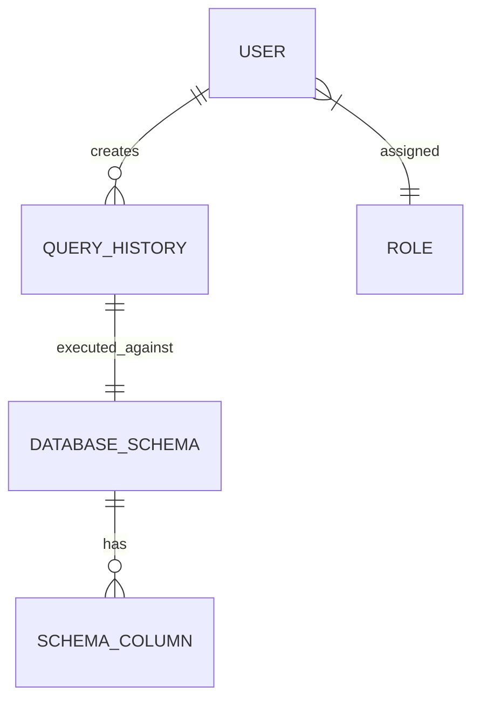

# Database Schema Specification

This document details the relational database schema design for **QueryGenAI** using PostgreSQL. All primary keys are UUIDs for global uniqueness, and timestamps are standard ISO-8601 strings.

---

## 1. Entity Relationship Overview

---

## 2. Table Definitions

### Table: `roles`
Stores role classifications used for role-based access control (RBAC).

| Column Name | Data Type | Constraints | Description |
| :--- | :--- | :--- | :--- |
| `id` | `UUID` | `PRIMARY KEY`, `DEFAULT gen_random_uuid()` | Unique identifier of the role. |
| `name` | `VARCHAR(50)` | `NOT NULL`, `UNIQUE` | Name of the role (e.g., `Admin`, `Developer`, `Viewer`). |
| `description` | `VARCHAR(255)` | `NULL` | Summary of role scope. |
| `created_at` | `TIMESTAMP` | `DEFAULT NOW()`, `NOT NULL` | Record generation timestamp. |

**Indexes:**
- `idx_roles_name` (UNIQUE B-Tree on `name`)

---

### Table: `users`
Stores user authentication details and active roles.

| Column Name | Data Type | Constraints | Description |
| :--- | :--- | :--- | :--- |
| `id` | `UUID` | `PRIMARY KEY`, `DEFAULT gen_random_uuid()` | Unique identifier of the user. |
| `email` | `VARCHAR(255)` | `NOT NULL`, `UNIQUE` | User email address. |
| `password_hash`| `VARCHAR(255)` | `NOT NULL` | Hashed password (Bcrypt). |
| `role_id` | `UUID` | `FOREIGN KEY REFERENCES roles(id)` | User access control role. |
| `is_active` | `BOOLEAN` | `DEFAULT TRUE`, `NOT NULL` | Toggle representing account access status. |
| `created_at` | `TIMESTAMP` | `DEFAULT NOW()`, `NOT NULL` | Account registration time. |
| `updated_at` | `TIMESTAMP` | `DEFAULT NOW()`, `NOT NULL` | Account update time. |

**Indexes:**
- `idx_users_email` (UNIQUE B-Tree on `email`)
- `idx_users_role_id` (B-Tree on `role_id`)

---

### Table: `database_schemas`
Stores sanitized table metadata (definitions and parameters) uploaded to define scope for prompt engineering. No raw database records are ever stored in this table.

| Column Name | Data Type | Constraints | Description |
| :--- | :--- | :--- | :--- |
| `id` | `UUID` | `PRIMARY KEY`, `DEFAULT gen_random_uuid()` | Unique schema identifier. |
| `name` | `VARCHAR(100)` | `NOT NULL` | Logical name of the database table representation. |
| `description` | `TEXT` | `NULL` | Textual description of what this table stores (injected as LLM context). |
| `created_at` | `TIMESTAMP` | `DEFAULT NOW()`, `NOT NULL` | Creation timestamp. |
| `updated_at` | `TIMESTAMP` | `DEFAULT NOW()`, `NOT NULL` | Modification timestamp. |

**Indexes:**
- `idx_database_schemas_name` (B-Tree on `name`)

---

### Table: `schema_columns`
Stores definition metadata for columns within database schemas.

| Column Name | Data Type | Constraints | Description |
| :--- | :--- | :--- | :--- |
| `id` | `UUID` | `PRIMARY KEY`, `DEFAULT gen_random_uuid()` | Unique column identifier. |
| `schema_id` | `UUID` | `FOREIGN KEY REFERENCES database_schemas(id) ON DELETE CASCADE` | Parent table schema context. |
| `name` | `VARCHAR(100)` | `NOT NULL` | Exact field/column database name. |
| `data_type` | `VARCHAR(50)` | `NOT NULL` | Database data type (e.g., `VARCHAR`, `INTEGER`, `DATE`). |
| `is_nullable` | `BOOLEAN` | `DEFAULT TRUE`, `NOT NULL` | Nullability parameter. |
| `description` | `VARCHAR(255)` | `NULL` | Explanation of the field's contents (injected as LLM context). |

**Indexes:**
- `idx_schema_columns_schema_id` (B-Tree on `schema_id`)

---

### Table: `query_histories`
Logs all NLP-to-SQL generation actions, status parameters, validations, and the final generated outputs.

| Column Name | Data Type | Constraints | Description |
| :--- | :--- | :--- | :--- |
| `id` | `UUID` | `PRIMARY KEY`, `DEFAULT gen_random_uuid()` | History record unique identifier. |
| `user_id` | `UUID` | `FOREIGN KEY REFERENCES users(id) ON DELETE SET NULL` | Reference to the user who requested the generation. |
| `prompt` | `TEXT` | `NOT NULL` | Natural language text prompt input. |
| `generated_sql`| `TEXT` | `NULL` | Generated SQL output from the LLM. |
| `is_valid` | `BOOLEAN` | `DEFAULT FALSE`, `NOT NULL` | Flag indicating validation status of the generated SQL. |
| `error_message`| `TEXT` | `NULL` | Parsing or validation error message description, if applicable. |
| `tokens_used` | `INTEGER` | `DEFAULT 0`, `NOT NULL` | Combined prompt and completion tokens used. |
| `created_at` | `TIMESTAMP` | `DEFAULT NOW()`, `NOT NULL` | Timestamp of query generation. |

**Indexes:**
- `idx_query_histories_user_id` (B-Tree on `user_id`)
- `idx_query_histories_created_at` (B-Tree on `created_at`)
