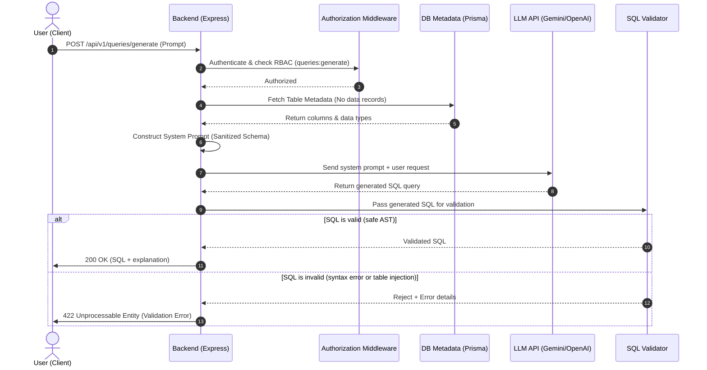

# LLM Translation and SQL Validation Flow

This document details the request-response lifecycle of natural language input translating into validated, secure SQL queries.

---

## 1. Request Lifecycle Diagram



---

## 2. Detailed Process Breakdown

### Phase 1: User Request
- The user inputs a query request in plain English (e.g. *"Show total revenue grouped by month for 2025"*).
- The client encapsulates the prompt and submits it to `/api/v1/queries/generate` with a JWT authentication header.

### Phase 2: Authorization & Middleware
- Express extracts the bearer token, decrypts the session parameters, and maps permissions against the active RBAC policy.
- Requests failing authentication trigger `401 Unauthorized`. Requests failing RBAC map filters trigger `403 Forbidden`.

### Phase 3: Schema Sanitization (No Data Records Exposure)
- > [!IMPORTANT]
  > **Security Directive: Under no circumstances are actual database records (row contents) transmitted to the LLM.**
- Instead, the backend retrieves only the *structural schema definition* (table names, column names, constraints, and data types) from the database metadata model using Prisma.
- Sensitive columns (such as password hashes, credit card tokens, or salt values) are filtered out at the application layer before prompt generation.

### Phase 4: LLM Context Construction (Prompt Engineering)
- The backend builds a strict system prompt containing the sanitized metadata.
- **System Prompt Template:**
  ```text
  You are an expert SQL Generator. Generate a PostgreSQL query ONLY.
  Use the following schema context:
  Table: orders
  - id (UUID, NOT NULL)
  - total_amount (DECIMAL, NOT NULL)
  - created_at (TIMESTAMP, NOT NULL)
  
  Do not explain. Return ONLY the raw SQL code. No markdown fences.
  ```

### Phase 5: SQL Validation Phase
- The string output from the LLM is intercepted by the backend before execution or response.
- **Syntax check**: Validated using SQL parsers (e.g. Abstract Syntax Tree (AST) validation) to confirm correct syntax.
- **Security Check (SQL Injection & Destructive Query Sanitization)**:
  - Validates that the query starts strictly with `SELECT` (read-only enforcement).
  - Rejects any query containing destructive statements like `DROP`, `DELETE`, `TRUNCATE`, `INSERT`, `UPDATE`, `ALTER`, or double-dash comment injection indicators `--`.
  - Ensures queries target only tables defined in the registered schemas.

### Phase 6: Response
- If validation passes, the generated SQL and a logical execution explanation are logged to database history and returned in a `200 OK` response.
- If validation fails, details are logged, and a `422 Unprocessable Entity` is returned to prevent execution of bad scripts.
